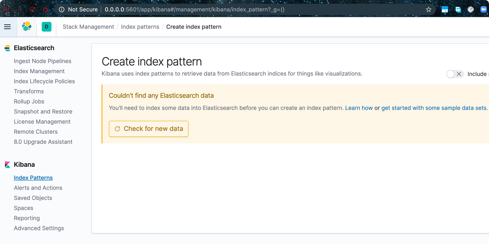

To Start Kibana on local and connect it to local docker-elastic-search on local

- For starting elastic search refer to the [task-005-elastic-search](../task-005-elastic-search)

- Check if elastic-search is running on local
```bash
$ docker ps | egrep elastic                                 
7fc9a4e5361c        docker.elastic.co/elasticsearch/elasticsearch:7.8.1   "/tini -- /usr/local…"   7 minutes ago       Up 7 minutes        0.0.0.0:9200->9200/tcp, 0.0.0.0:9300->9300/tcp   docker run --link dreamy_borg:elasticsearch -p 5601:5601 docker.elastic.co/kibana/kibana:7.8.1
```


- Start the docker-kibanan on local
```bash
$ docker run --link dreamy_borg:elasticsearch -p 5601:5601 docker.elastic.co/kibana/kibana:7.8.1
```


- Kibana will not come up if its unable to connect to elastic search. You will see the following in logs
```bash
{"type":"log","@timestamp":"2020-07-30T09:37:59Z","tags":["warning","elasticsearch","admin"],"pid":7,"message":"Unable to revive connection: http://elasticsearch:9200/"}
``` 

- Once the Kibana is up you can visit the dashboard at [http://0.0.0.0:5601/app/kibana](http://0.0.0.0:5601/app/kibana)
  You can verify the elastic search connection by checking Index Pattern settings page.
  
